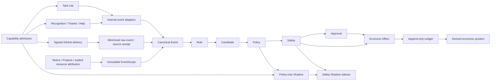

# Architecture, event contracts and transaction boundaries

Canonical topic document at code baseline `f1600b580a540b55fbb8e62e1e7caa47962c313a`.
Authority: Source Code → DB/Migrations → Explicit Contracts → Graphify.
Phase-specific measurements below are historical evidence, not tests rerun by this sweep.

## Contents

- [ARCHITECTURE](#contract-architecture)
- [CANONICAL EVENT CONTRACT](#contract-events-canonical-event-contract)
- [INTERNAL EVENT CATALOG](#contract-events-internal-event-catalog)
- [NOTIFICATION ARCHITECTURE](#contract-notification-architecture)
- [BACKEND CONTRACTS](#contract-cohesion-backend-contracts)
- [DEPENDENCIES AND TRANSACTIONS](#contract-maturity-dependencies-and-transactions)

<a id="contract-architecture"></a>
<a id="contract-architecture-current-architecture-through-ws4"></a>
## Current architecture through WS4

E11 baseline: `f310c0ed12d2e3bf912ed7c34c9112689c9a97ba`; extended by
[company capability controls](ORGANIZATION.md#contract-capabilities-capability-controls-v1) and
[optional organizational context](ORGANIZATION.md#contract-organization-context-v1).
All hosting models use [one domain core](adr/ADR-CORE-DEPLOYMENT-MODEL.md):
managed cloud, self-hosted/on-premise and API/headless access do not change
permissions, tenant boundaries or economic meaning.

The current maturity audit records [cross-module dependencies and transaction
ownership](ARCHITECTURE.md#contract-maturity-dependencies-and-transactions). This gate does not add an
automatic orchestrator or change Core contracts.

<a id="contract-architecture-incentive-path"></a>
### Incentive path

```text
Event → Rule → Candidate → Policy → Safety → Approval where required
      → Economic Effect → Ledger → derived wallet position
```

This is the logical authorization sequence, not an automatic event bus.
Ingestion, Rule evaluation, Policy evaluation, approval creation and issuance
have explicit entry points. Live issuance obtains the candidate's current
Safety assessment. Existing Policy REQUIRE_APPROVAL requests can be created
independently; the final issuance gate still enforces Safety. Historical Task
rewards and redemptions retain their own existing services and do not get paid
again by observing their events.

| Boundary | Source of truth / responsibility |
| --- | --- |
| Availability | `backend/app/capabilities/`: fixed company flags, Admin audit, transaction-scoped module admission; mandatory Safety cannot be disabled |
| Canonical facts | `backend/app/canonical_events/`: immutable tenant-scoped events and deduplication |
| Ingress and producers | `backend/app/ingestion/`, `collaboration/`, `github_connector/`: source authentication, domain validation, normalization |
| Source authority | `backend/app/source_authority/`: generic trusted producer receipts plus the closed legacy E7 contract; a type name is not payment authority |
| Rules / Candidates | `backend/app/rules/`: deterministic matching and immutable candidate snapshots |
| Policy | `backend/app/policies/`: immutable governance decision; BLOCK > SHADOW_ONLY > REQUIRE_APPROVAL > ALLOW; no-match REQUIRE_APPROVAL |
| Safety | `backend/app/incentive_safety/`: bounded history, immutable findings/current reference, Admin settings and explicit refresh |
| Approval | `backend/app/approvals/`: immutable request and final human decision, exact eligible provenance |
| Execution | `backend/app/economic_effects/`: guarded explicit issuance and reversal |
| Accounting | `backend/app/ledger.py`, `economy_position.py`: one signed ledger and derived position |
| Observation | `backend/app/shadow/` plus E11 Safety sidecar: hypothetical evidence only |

<a id="contract-architecture-invariants"></a>
### Invariants

- **Availability is separate from economic authority.** Optional module gates
  affect future module use, not Rule/Policy/Safety decisions or recorded facts.
  All default enabled; disable preserves history and prior economics.

- **Safety remains separate from Policy.** Safety precedence is
  SUPPRESS_INCENTIVE > REQUIRE_REVIEW > OBSERVE > CLEAR. Policy enums and
  precedence are unchanged. No AI, reputation score or automatic punishment.
- **Approval is conditional.** Ordinary ALLOW has no ApprovalRequest. ALLOW plus
  current REQUIRE_REVIEW permits an INCENTIVE_SAFETY request tied to exact
  company, PolicyDecision, Candidate and immutable SafetyEvaluation. Approval
  for A cannot authorize B. Policy REQUIRE_APPROVAL keeps its existing path;
  suppression vetoes payment and cannot be overridden. Existing role,
  lifecycle, self-approval and finality rules still apply.
- **Shadow produces no real economics.** E10 records hypothetical results; E11
  adds an immutable Safety sidecar. Neither creates a real approval request,
  EconomicEffect or ledger entry. SHADOW_ONLY never becomes live payment.
- **Ledger is append-only in business flows.** Credits/reversals are linked to
  immutable provenance. Corrections append entries; they do not rewrite history.
  The existing explicit development reset exception for legacy rows is not an
  economic deletion API and cannot erase E7 history.
- **Wallet is derived.** netPosition = SUM(ledger), spendableBalance = max(0, net),
  coinDebt = max(0, -net). Negative net position is supported; no stored wallet
  balance or invented debt-settlement entry exists.
- **Tenant isolation is enforced in services and PostgreSQL.** Scoped queries,
  composite foreign keys, authorization revalidation and tenant-bounded history
  prevent foreign provenance from authorizing access or payment.
- **Economic effects are exactly-once per identity:**
  UNIQUE(company_id, candidate_id, effect_type), with INCENTIVE_CREDIT as the
  effect type. A reversal consumes its original effect once; reissuing a reversed
  candidate is forbidden. Locks coordinate writes; unique and deferred database
  guards remain authoritative. Effect and ledger append commit atomically.
- **Provider-specific logic stays outside Core.** GitHub signature verification,
  repository binding, mapping, minimization and Issue/PR normalization live in
  `github_connector/`. Rules, Policy, Safety and Ledger do not branch on GitHub.
  Unmapped users never receive a guessed economic beneficiary; issuance requires
  a same-company participant subject. Receipt alone creates no reward.
- **Safety history is bounded and frozen.** The first assessment is retained;
  later arrivals/settings require explicit refresh. History uses occurrence
  time and one bounded SQL snapshot. New findings do not reverse old payments.

<a id="contract-architecture-persistence-and-current-schema"></a>
### Persistence and current schema

Alembic owns production schema. The chain adds E7 `e70a1c9e2601`, E8 source
receipts `e80a1c9e2602` and collaboration `e80b2d9e2603`, E9 `e90a1c9e2601`,
E10 `ea01c9e2601`, E11 `eb01c9e2601`, capabilities `ec01c9e2601`, organization `ed01c9e2601`, WS1 `ee01c9e2601`, then WS1.1 head `ee02a1b3c402`. E7.1 is a test-only replay
foundation and has no new migration. History-preserving downgrade barriers are
intentional; an empty-history rollback test is not permission to delete history.

The browser demo's TypeScript reducer is a parity-maintained preview, not a
second production authority. Server mode uses authenticated APIs; backend
capabilities do not require the SPA. See [runtime](OPERATIONS.md#contract-runtime) and the detailed
[contract index](README.md). The [integration maturity gate](HISTORY.md#maturity)
is PASS; Cohesion is complete and human UAT remains a separate gate; see [roadmap gates](PRODUCT.md#next-boundary).

<a id="contract-architecture-optional-organizational-context"></a>
### Optional organizational context

[Team/Project context](ORGANIZATION.md#contract-organization-context-v1) filters eligibility and current
management authority. Company remains the tenant; capabilities and Safety remain
company-scoped. Exact Team/Project scope does not override a more severe Company
Policy. Immutable organization-owned event associations preserve occurrence
context without changing the Canonical Event envelope. Current membership never
relabels completed economics or Shadow history.

GitHub resource attribution belongs to the connector: Admin explicitly assigns
numeric Issue/PR resource IDs within the source tenant. Shared repository binding,
participants, text and branches cannot confer Project scope. Unassigned resources
remain COMPANY and cannot match Project Rules/Policies. Attribution intervals and
accepted event associations preserve historical meaning across later changes.


<a id="contract-architecture-integrated-maturity-verification"></a>
### Integrated maturity verification

The [System Integration / Maturity Gate](HISTORY.md#maturity) is CLOSED / PASS.
The only production correction serializes task and cycle mutations under the
existing company organization lock before account/capacity locks. This preserves
scope and capacity checks while preventing a verified lock-upgrade deadlock;
see [M1](HISTORY.md#maturity). Cohesion and WS1–WS4 are closed; independent docs review precedes WS5. The gate does
not imply a complete governance web UI or production capacity certification.


<a id="contract-events-canonical-event-contract"></a>
<a id="contract-events-canonical-event-contract-canonical-business-event-contract--e11"></a>
## Canonical Business Event contract — E1.1

The E1.1 Core contract remains the event foundation. Its phase-boundary and
verification sections describe E1.1, not the absence of later engines. See
[current architecture](ARCHITECTURE.md#contract-architecture) for implemented consumers through E11.

Status: implemented event foundation; E1 phase-only exclusions below do not describe later modules. Deployment constraint:
[one core, three deployment modes](adr/ADR-CORE-DEPLOYMENT-MODEL.md).

<a id="contract-events-canonical-event-contract-purpose-and-boundaries"></a>
### Purpose and boundaries

A Canonical Business Event records a source-owned fact once, independently of its
future outcomes. Adding a source requires no CanonicalEvent model, enum or schema
change. PostgreSQL is the store; no broker, registry service or plugin runtime.

`backend/app/canonical_events/` is distinct from `backend/app/events.py` and
`src/domain/events.ts`. Those existing **Structured UI Event** codes and params
format Activity, Notification and Ledger history. They are not Canonical Business
Events. Their tables, code lists, helpers and behavior remain unchanged.

E1.1 introduced no adapters, rule/policy/approval engines, economic effects,
notifications, recognition, connectors, webhooks, capability discovery or event UI.
The subsequent [E1.2 internal catalog](ARCHITECTURE.md#contract-events-internal-event-catalog) adds exactly five
same-transaction observations through feature-owned adapters; this Core contract
and schema remain unchanged. Existing business services retain authority.

<a id="contract-events-canonical-event-contract-envelope-and-storage"></a>
### Envelope and storage

Table: `canonical_events`. IDs use strings up to 40 characters; generated event IDs
are `ce-` plus a full UUID4 hex string. Timestamps follow existing CVE conventions:
finite, nonnegative UTC epoch milliseconds, stored as PostgreSQL double precision.
There is no timezone-local interpretation. Accepted timestamps are at most
253402300799999 (end of year 9999). Late/out-of-order events are allowed.

| Field | Meaning and ownership |
| --- | --- |
| `id` | Core-generated immutable event identity. |
| `company_id` | Required tenant from trusted caller context, never from source payload. |
| `type` | Module-owned fact name; validated string, maximum 128 characters. |
| `schema_version` | Required integer 1..2147483647, initially 1; booleans/coercion rejected. |
| `source_kind` | Extensible uppercase module namespace, maximum 64 characters. |
| `source_id` | Optional stable source instance/installation namespace, maximum 200 characters. |
| `source_event_id` | Optional source-assigned delivery/fact identity, maximum 200 characters. |
| `actor_id` | Optional known CVE user causing the event; same-company FK. |
| `subject_id` | Optional primary affected CVE user; same-company FK. |
| `occurred_at` | Required source-supplied occurrence time. |
| `received_at` | Core time at entry to the successful append request. |
| `created_at` | Core time immediately before persistence. |
| `payload` | Required module-owned JSON object; JSONB storage. |
| `evidence` | Optional array of structured references; JSONB or SQL NULL. |
| `dedupe_key` | Persisted 64-character SHA-256 identity digest, algorithm below. |
| `correlation_id` | Optional opaque flow identifier, maximum 200 characters; no FK or workflow logic. |
| `causation_id` | Optional existing prior CanonicalEvent in the same company; composite FK. |

Optional identifiers must be absent (`None`) or nonempty strings without leading/
trailing whitespace, control characters or invalid Unicode. There are no implicit
normalizations that could collapse distinct identities. Actor/subject may be any
user role, including managers and admins. Deactivation preserves references;
historically referenced users cannot be hard-deleted through FK cascades.

<a id="contract-events-canonical-event-contract-naming-and-versions"></a>
### Naming and versions

Type grammar is exactly three lowercase segments:
`[a-z][a-z0-9_]*\.[a-z][a-z0-9_]*\.[a-z][a-z0-9_]*`.
Examples: `internal.task.approved`, `system.user.activated`,
`manual.recognition.created`, `example.custom.completed`. These are examples,
not implemented sources. `task`, `TASK_APPROVED`, `internal..approved`, whitespace
and slash-separated names are rejected. Keep type stable across schema versions;
do not encode a version in the name. Source modules own payload version validation
and compatibility, not Core.

Source kind grammar is `[A-Z][A-Z0-9_]*`. TASK_LITE, MANUAL, SYSTEM and future valid
names all work without a central enum. Ownership/naming collisions must be resolved
between source modules. Core does not inspect source-specific payload semantics.

<a id="contract-events-canonical-event-contract-dedupe-and-transactions"></a>
### Dedupe and transactions

Supply exactly one of `source_event_id` or a module-provided deterministic
`EventInput.dedupe_key` (maximum 200 characters). With a source event identity,
do not also supply a dedupe key. Without one, the module must derive a stable key
from its command/fact identity; Core never invents a random fallback.

Persisted key = lowercase hex SHA-256 of UTF-8 JSON with `ensure_ascii=False` and
compact separators `(',', ':')`, containing this ordered array:

```text
["cve-event-v1", company_id, source_kind, source_id,
 "source", source_event_id]
```

For module-supplied identity, replace the last two elements with
`"module", input.dedupe_key`. Absent `source_id` is JSON null. This namespaces
identities by company, source kind and source instance; two installations may reuse
a delivery ID. The source/module discriminator prevents collisions between identity
forms. Payload, type, schema version and all timestamps are deliberately excluded:
one source fact cannot become a new event merely by changing its contents on retry.

`UNIQUE(company_id, dedupe_key)` is the race-safe authority. Append uses PostgreSQL
`INSERT ... ON CONFLICT DO NOTHING`, followed by a tenant-scoped read. Duplicate
behavior is **return the original event unchanged** (first committed writer wins),
including original payload/evidence and timestamps. Changed content under the same
identity does not overwrite history. Invalid envelopes/references are still
rejected before duplicate resolution. Corrected facts need a new identity; no
correction/reversal semantics are implemented yet.

`PostgresEventStore` uses a caller-provided SQLAlchemy Session and does not commit
or roll back it. Follow existing caller-owned transaction conventions. Under the
default PostgreSQL READ COMMITTED isolation, concurrent writers wait and return
one event. On serialization/deadlock errors at stronger isolation, the caller
must roll back and retry the whole transaction. An ID returned before caller commit
is not a durable acknowledgment. Rollback leaves no event. No business effects are
performed by the store.

<a id="contract-events-canonical-event-contract-payload-and-evidence-safety"></a>
### Payload and evidence safety

Payload root must be a plain JSON object. Allowed nested values: plain dictionaries
with string keys, lists, strings, finite numbers, booleans and null. Python models,
tuples, bytes, functions, NaN/infinity, NUL, invalid Unicode and cyclic/deep structures
are rejected. Nesting limit: 20. Maximum serialized payload: **16,384 UTF-8 bytes**
using compact JSON; oversize is refused before insertion. This is not file storage.

Evidence is absent or at most ten objects, totaling **8,192 UTF-8 bytes**, with:

```json
[{"kind":"file","reference":"attachment-123","label":"Submission proof",
  "metadata":{"revision":1}}]
```

Required `kind`: lowercase identifier `[a-z][a-z0-9_.-]*`, up to 64 characters.
Required `reference`: up to 1024 characters, either an opaque stable ID/path using
`[A-Za-z0-9][A-Za-z0-9_./-]*` or an HTTPS URL with a host, no credentials, query,
fragment or backslash. Optional label: 1..200 characters. Optional metadata: JSON
object. Unknown evidence fields are rejected. References are **never fetched,
executed, resolved as filesystem paths or granted access by Core**. HTTPS-only
validation is not a network authorization system.

Do not store passwords, keys, tokens, cookies, authentication headers or raw webhook
headers in payload/evidence. A recursive conservative key denylist catches common
credential/header names, including normalized `api_key`, `access_token` and
`authorization`. This is defense in depth, not secret detection: arbitrary free text,
labels and URL paths can still contain secrets. Source modules must redact them
before normalization and use stable IDs instead of signed/tokenized URLs. Payload
is data only; no evaluation, unsafe deserialization or interpolated payload SQL.
No payload/evidence is logged by the store or included in validation errors.

Storing a file reference does not bypass file authorization. Future event readers
must enforce any module-specific visibility and existing attachment access rules;
tenant membership alone is not a grant to private Task evidence.

<a id="contract-events-canonical-event-contract-tenant-causation-and-immutability"></a>
### Tenant, causation and immutability

Every public store operation requires company scope. Future API/adapters must derive
it from authenticated context, never accept it as a trusted caller-controlled field.
The internal store is not itself an authentication/role engine. It checks that the
company exists, user references belong to it, and causation exists in it. Missing
and foreign event IDs both produce the same `DomainError('NOT_FOUND', ...)`.

Composite foreign keys `(company_id, actor_id/subject_id)` reference users, and
`(company_id, causation_id)` references CanonicalEvent. The supporting unique user
index adds no fields or behavior. FK checks also close concurrent reference-change
races. No delete cascade exists. Causation cannot point to self; append can only
reference an existing event. There is no traversal/cascading engine. Correlation is
an opaque grouping value; consumers must always scope any later lookup by company.

Store API: **append/get only**. Returned `StoredEvent` is a frozen detached snapshot;
nested JSON copies cannot mutate stored history. PostgreSQL rejects row UPDATE and
DELETE via an append-only trigger, including direct SQL and ORM writes. Schema
migration, explicit privileged maintenance and test fixture TRUNCATE are separate
administrative operations, not business APIs. Table owners can override database
guards; do not hand application consumers database-owner privileges.

<a id="contract-events-canonical-event-contract-extension-boundary-and-example"></a>
### Extension boundary and example

Only currently useful protocols exist: `EventNormalizer[Raw]` maps module-owned data
to `EventInput`; `EventStore` offers append/get. `PostgresEventStore` implements the
latter structurally. Source adapters own authentication, source identity, redaction,
payload schema/version semantics and resource authorization. Core owns envelope
validation, tenant/reference integrity, dedupe and persistence. No fake source or
future engine implementation ships in production.

```python
from app.canonical_events.contracts import EventInput
from app.canonical_events.store import PostgresEventStore

# db and authenticated_company_id supplied by a trusted internal transaction owner.
event = PostgresEventStore(db).append(authenticated_company_id, EventInput(
    type="example.custom.completed", schema_version=1,
    source_kind="EXAMPLE_MODULE", source_id="installation-1",
    source_event_id="delivery-42", occurred_at=1700000000000,
    payload={"moduleOwned": {"result": "complete"}},
))
db.commit()
```

No React, SPA, browser storage, seed dependency, fixed hostname or founder machine
path exists in this subsystem. Managed, self-hosted and headless deployments use
the same store. There are **no new API endpoints**, including no generic ingestion
or audit endpoint: an internal append/read boundary is sufficient for E1.1.

<a id="contract-events-canonical-event-contract-migration-and-verification"></a>
### Migration and verification

Revision `e11a0c7e2601`, parent `c71a1d902e64`. Upgrade creates the new table,
constraints, append-only trigger and supporting users uniqueness. It neither
backfills events nor modifies existing business rows. Indexes: tenant/dedupe
uniqueness, tenant/id FK target and tenant/created_at audit ordering. No speculative
type/source indexes. Alembic registers the separate model explicitly; production
schema creation remains migration-owned.

Downgrade drops this phase's table/history, trigger function and supporting user
constraint, consistent with existing schema rollback conventions. Export event
history before an explicitly authorized rollback; do not downgrade production just
to undo application code. No production database was migrated during development.

Tests: `test_canonical_events.py` covers validation, detached history, immutable DB
writes, actual bearer-token tenant scoping via a test-only route, reference FKs,
four-writer PostgreSQL dedupe, transaction rollback, future module acceptance and
absence of Task/Ledger/Notification/Activity effects. `test_canonical_event_migration.py`
checks fresh and seeded prior-head upgrades, all existing row snapshots, constraints,
append-only behavior, downgrade and re-upgrade. The test fixture uses a disposable
database and intentionally truncates tables: never point it at founder/pilot data.
`canonical_event_typing.py` is a test-only static extension proof, checked with
mypy 1.19.1; no type-checker is a runtime dependency.

Verified on 2026-09-24: baseline backend/N7.1 smoke 24 passed; full backend suite
258 passed, followed by 65 focused event/migration tests after final byte-limit
hardening; frontend smoke 162 passed; TypeScript passed; demo/server builds passed;
all 22 focused N7.1 Playwright cases passed (server-mode browser tests use their
existing API interception; backend tests use real isolated PostgreSQL). Existing
dependency deprecations and Vite bundle-size warnings remain. Extension protocols
and the future-source proof passed mypy. Graphify symbol inspection found no UI
dependency; broad undirected neighborhoods also show other consumers of shared
User/Company metadata and must not be mistaken for runtime dependencies.

Full backend tests: `python -m pytest -q` from `backend`, with
`CVE_TEST_DATABASE_URL` explicitly set to an isolated PostgreSQL instance whose
role can create the scratch migration database. Frontend smoke and demo/server
builds remain the existing npm commands. Graph workflow stays in
[REPOSITORY_INTELLIGENCE.md](REPOSITORY_INTELLIGENCE.md).

<a id="contract-events-canonical-event-contract-graphify-impact-review"></a>
### Graphify impact review

Before source exploration, seven queries covered Activity/helpers, Notifications,
Ledger/audit, models/migrations, service boundaries, naming conflicts and likely
new-event touchpoints. Source verification identified `app/models.py`, `events.py`,
`service_common.py`, `routes.py`, `services.py`, task/reward/cycle services,
`serializers.py`, `security.py`, `db.py`, Alembic env/revisions and migration tests,
plus `src/domain/events.ts` and `components/EventText.tsx`. Broad graph results were
noisy/truncated; source inspection established the distinct namespace and narrow
integration points. Existing business services and frontend files need no changes.
Refresh with `npm run graph`, then check `npm run graph:status` and inspect
`PostgresEventStore`/`CanonicalEvent` neighbors. Graph remains navigation, not truth.


<a id="contract-events-internal-event-catalog"></a>
<a id="contract-events-internal-event-catalog-internal-canonical-observations--e12"></a>
## Internal canonical observations — E1.2

This document preserves the E1.2 observational contract. E8's additional trusted
collaboration facts are documented in [E8 Collaboration](RECOGNITION_HELP.md#contract-collaboration-e8-collaboration):
`internal.peer.thanks`, `internal.manager.recognition`, `internal.help.completed`.

Existing business services remain authoritative. These five observations join the
same PostgreSQL transaction **after** business authorization, mutation and existing
Ledger/Activity/Notification work, and **before** the caller commits. They never
drive rewards, balances, approvals or notifications. No other event is integrated.

<a id="contract-events-internal-event-catalog-adapter-pattern-and-failure-contract"></a>
### Adapter pattern and failure contract

```text
task_services.approve_work / reject_work -> task_events.record_task_review
reward_services.redeem / fulfill_redemption -> reward_events
pilot_accounts.activate -> user_events.record_user_activated
    -> internal_event_recorder.record_internal_event
    -> canonical_events.store.PostgresEventStore.append
```

Feature modules own mappings. Core remains unchanged and has no imports from task,
reward, auth or user feature services. The shared recorder only flushes pending
business writes, builds the envelope, checks active same-company user references,
and calls EventStore using the **same Session**. It never commits or opens another
transaction/session. No hooks, jobs, outbox, broker or background dispatcher.

Mapping, validation or event persistence failure rolls back the **entire** Session
transaction, including already-flushed business rows and earlier canonical inserts.
This also prevents an internal caller from catching an error and accidentally
committing partial work. API transaction owners retain their existing rollback
handling. The safe domain error is `EVENT_RECORDING_FAILED`, HTTP 503, with
`Unable to record the action. No changes were saved.` No SQL, payload, evidence,
credential or original exception text is returned/logged by the recorder.

This failure outcome is the intentional E1.2 availability tradeoff. Successful
responses, business guards, calculations, stock/debit timing, activity and notification
routing are unchanged. No canonical fields are added to bootstrap or API responses.

<a id="contract-events-internal-event-catalog-catalog-schema-version-1"></a>
### Catalog (schema version 1)

All timestamps are the existing business-action UTC epoch milliseconds. All
evidence and causation fields are null. Every envelope is tenant-scoped by the
existing service context. No event endpoint or browser/UI capability is added.

| Event | Source kind | Actor / subject | Payload |
| --- | --- | --- | --- |
| `internal.task.approved` | TASK_LITE | reviewer / owner | taskId, cycle, ownerId, reviewerId, verifiedProgress, priority, audience, reward, paid |
| `internal.task.rejected` | TASK_LITE | reviewer / owner | taskId, cycle, ownerId, reviewerId, verifiedProgress, priority, audience, reportedProgress, reasonReference |
| `reward.redemption.created` | REWARDS | redeemer / redeemer | redemptionId, rewardId, userId, cost, rewardEligibility, status |
| `reward.redemption.fulfilled` | REWARDS | fulfilling actor / redeemer | redemptionId, rewardId, redeemerId, fulfilledBy, cost, status |
| `system.user.activated` | SYSTEM | null / activated user | userId, role, activationMethod=`activation_link` |

`cycle` is the existing authoritative cycle number, not a new field or identifier.
`reward` is total task reward; `paid` is cumulative paid amount after approval,
not a new payout command. Rejection's `reasonReference` points to the existing
Activity row containing the authoritative review reason. There is no duplicated
reason, task title/description, comment, attachment body, fulfillment tracking note,
person name/email, password/hash, token/hash, JWT or headers. The explicit audience
classification is retained; it does not grant access to private task information.
Any future reader must enforce source-resource visibility, not just tenant scope.

Task events use `task.updated_at`; redemption-created uses `redemption.at`;
fulfillment uses `redemption.fulfilled_at`. Activation records the completion time
after setting the password and clearing the activation credentials in-transaction.
This time is not used for dedupe. Activation has no separate authenticated actor.

<a id="contract-events-internal-event-catalog-identity-retries-and-relationships"></a>
### Identity, retries and relationships

| Event | sourceId | sourceEventId | correlationId |
| --- | --- | --- | --- |
| Task approved | task ID | `approved:<activity ID>` | `task:<task ID>:cycle:<cycle number>` |
| Task rejected | task ID | `rejected:<activity ID>` | same task-cycle format |
| Redemption created | redemption ID | `created:<redemption ID>` | redemption ID |
| Redemption fulfilled | redemption ID | `fulfilled:<redemption ID>` | redemption ID |
| User activated | user ID | `activated:<user ID>` | null |

Core derives its existing SHA-256 dedupe key from these identities. No random ID
is generated by an adapter. Task review identity is the **already-created
authoritative Activity row**, whose ID is materialized by flush. Returning that
record from the existing `act` helper does not change its persistence semantics.
This distinguishes multiple legitimate reject/resubmit/reject transitions inside
one task cycle without adding a schema field or relying on timestamp uniqueness.
The same review row supplied twice produces one canonical row, with original
content retained. Replays must reuse the authoritative record, not invent an audit.

Redemption fulfillment is a guarded terminal transition. Initial account activation
is one-time per user in the current lifecycle; activation-link reissue before
completion does not create another lifecycle. Login, provisioning and account
reactivation do not emit `system.user.activated`. If repeated activation lifecycles
are introduced later, define a real lifecycle identity before extending this adapter;
never use an activation secret/hash as event identity.

Existing second-approval/fulfillment/activation guards remain in place. Adapter
dedupe does not turn a refused command into success. A new redemption POST retains
existing semantics: it creates a new business request if guards allow, with its own
redemption ID and event. E1.2 adds no HTTP request-idempotency contract.

Task cycles and redemptions already identify meaningful flows, so they are used
for correlation. No synthetic causation is asserted: these actions were not caused
by a previous CanonicalEvent. Creation and fulfillment share correlation but no
fabricated causal edge.

<a id="contract-events-internal-event-catalog-security-and-deployment"></a>
### Security and deployment

Call adapters only from authorized feature services after validations succeed;
they are not standalone authorization APIs. Existing tenant/task visibility,
review delegation, self-review, fulfillment and activation guards remain decisive.
Forbidden, missing, expired-token and invalid-state requests create no event.
The recorder rejects inactive, unactivated, missing or foreign-tenant user references;
Core retains its same-company FKs and append-only database protection.

There is no frontend, browser storage or SPA dependency. Headless and web clients
reach the same backend services and receive identical observations. Demo reducer
behavior and storage are unchanged. No new dependencies or migration; database
head remains `e11a0c7e2601`. Deployments must already have that E1.1 migration.

<a id="contract-events-internal-event-catalog-verification-and-overhead"></a>
### Verification and overhead

`test_internal_events.py` checks all envelope fields, exact minimized payloads,
adapter replay for all five types, two rejections in one cycle, guarded command
replay, unauthorized/self-review/cross-tenant attempts, deferred actions and a
concurrent approval. A successful action issues one canonical INSERT and one
canonical lookup. The existing generic store and active-reference guard add at
most four bounded user/company existence queries, independent of collection size.
There is no event loading in bootstrap, polling or per-recipient event fanout.
This is a query-count sanity check, not a production latency benchmark.

`test_internal_event_atomicity.py` runs each of the five flows against real
PostgreSQL with three injected failures: an INSERT-rejecting database trigger,
a SQL error after an actual successful event INSERT, and invalid event validation.
Fresh-session snapshots compare every persisted table before/after failure,
including task/cycle/submission/contribution state, ledger, stock, redemptions,
notifications, activity and activation password/token state. Retrying after the
failure is removed succeeds, including reuse of the unconsumed activation link.
The architecture test checks Core imports without adding a testing framework.

Run the full backend suite on an isolated database, all E1.1/E1.2 tests, TypeScript,
frontend smoke, demo/server builds and `playwright test n71`. Never point destructive
test fixtures at founder/pilot databases. Graphify must be refreshed after changes;
inspect adapter/store edges and verify source directly when broad neighborhoods
include unrelated consumers of shared model metadata.

This E1.2 adapter change included no E2 work. E2 and later phases are now
implemented separately; see [current status](PRODUCT.md#status).


<a id="contract-notification-architecture"></a>
<a id="contract-notification-architecture-e2-transactional-in-app-notification-routing"></a>
## E2: transactional In-App notification routing

Notifications describe user attention; Activity records history; Canonical Events
record domain observations. All three remain separate. E2 reuses the existing
`notifications` table and response contract, with no migration or dependency.

<a id="contract-notification-architecture-inventory-and-migration-scope"></a>
### Inventory and migration scope

| Group | Sources | Delivery after E2 |
| --- | --- | --- |
| Pilot-critical | Task assignment/availability, submission/review, approval/rework; redemption request, approval, executor attention, fulfillment and cancellation | Existing feature decisions → `note`/`notes` → router → In-App |
| Secondary | Task decline/return, edits/reassignment, handoff, cancellation/reopen/reactivation; administrative economic adjustment and capacity changes | Same bridge and router; all live backend creation paths migrated |
| Dev/test-only | `seed.py` historical demo fixtures; frontend demo reducer and Test Lab | Unchanged, isolated from production routing |
| No existing notice | Account activation | Still no notification; E1.2 activation event remains separate |

Source inventory: `service_common.py`, `task_services.py`, `task_cycle_services.py`,
`reward_services.py`, `seed.py`. A lightweight AST test enforces that the only
backend Notification constructors are the In-App adapter and demo seed fixtures.
Read/archive updates and workspace reset are not notification creation paths.

<a id="contract-notification-architecture-contract-and-ownership"></a>
### Contract and ownership

```text
Feature authorization and recipient selection
  → service_common.note / notes (feature-facing visibility bridge)
  → NotificationIntent
  → NotificationRouter
  → InAppNotificationChannel
  → existing Notification row, same Session and transaction
```

`NotificationIntent` contains company, recipient, level, category, structured event
key, semantic params and occurrence time. Existing task/redemption/reward IDs and
object type/ID are retained in params; there is no URL, React component, provider
template, new severity scale or deep-link language. Params are copied at routing
time so subsequent caller mutations cannot change the staged snapshot.

Canonical usage for current feature services is **`note(...)`** for one recipient
or **`notes(...)`** for one observation sent to a recipient collection. These are
compatibility/feature bridges, not alternative delivery engines. They own the
existing private-task `can_view` check; the router does not import feature access
rules or services. A new feature using the router directly must first authorize
its source resource and every recipient. Neither the router nor an existing
notification grants view/review/fulfillment authority.

The router validates the full batch before staging rows: company consistency,
known structured key, category/level, finite timestamp, JSON-compatible params,
priority, recipient existence/company and recognized source/navigation references
(task, reward, redemption, user). References must exist in the same company.
Inactive recipients are skipped. Active users awaiting activation remain eligible
at this generic boundary, matching the old helper; management recipient pools
continue excluding them. Inactive historical rows are not deleted or rewritten.

The channel interface stages intent batches. Current `NotificationRouter` stages both `InAppNotificationChannel` and the WS1 `OutboundChannel` in the caller transaction; outbound selects only the three approved push classes. Routing performs no network send and returns `STAGED` or `SKIPPED` with counts. STAGED means pending commit, not delivery confirmation. A separate delivery worker owns retry/backoff and terminal outbox state; see [operations](OPERATIONS.md).

<a id="contract-notification-architecture-product-compatibility"></a>
### Product compatibility

Stored levels remain `ACTION_REQUIRED`, `IMPORTANT`, `INFORMATIONAL`, `AUDIT_ONLY`.
Categories include `Tasks`, `Reviews`, `Assignments`, `Rewards`, `Economy`, plus later `Collaboration` and `Incentives` additions.
The future ACTION/INFORMATION/ALERT taxonomy is not imposed on this different
existing category model. Task priority remains the existing optional `pri`.

Structured uppercase event keys and params still localize through `EventText`.
User-authored prose remains unchanged; the channel writes empty legacy `text`.
No new UI string is introduced. No activation credential enters an intent because
activation has no notification-producing path. Sensitive params are not logged.

Existing task IDs and redemption IDs still drive frontend direct navigation.
Ownership, read/archive endpoints, mark-all behavior, muted levels and unread
counts are unchanged. Bootstrap returns newest-first rows; the UI retains its
unread/action-required/task-priority ordering with recency as the existing tie
breaker. Read rows use recency. This is not changed to unconditional newest-first.

The frontend audio code is untouched: initial bootstrap is silent, only new
relevant notices sound, preferences are respected, one tone per batch and a
one-second throttle prevent bursts. Toast close behavior, stale identity handling,
English/Persian/Hebrew presentation and RTL navigation remain on their current paths.

<a id="contract-notification-architecture-transactions-dedupe-and-fan-out"></a>
### Transactions, dedupe and fan-out

All existing In-App notifications are transactional, including informational ones.
That existing policy remains: validation/persistence exceptions propagate to the
business transaction owner, which rolls back all effects. Neither router nor
channel commits, opens another Session, sends after commit, or hides DB failure.
No new error mapping or API shape is introduced. E1.2's safe event-recording error
can still handle a flush failure encountered at its own boundary.

There was no persistent global notification dedupe key. E2 does not invent one:
two valid business actions may create identical notices. Existing locked business
state guards still reject repeated approval/fulfillment. `notes` removes duplicate
recipient IDs within a single shared observation; separate calls remain distinct.

Management task availability now gathers the same eligible recipients once and
uses one snapshot and batch. No Employees, inactive users, pending activations or
foreign-company Managers enter that pool. Other sources retain their existing
selection loops through the single-recipient bridge.

Router recipient and target checks are set-based; SQLAlchemy stages all eligible
rows together. Tests at 1, 10 and 50 recipients assert exact counts and at most six
SQL statements (including batched INSERT) for the task/actor fan-out bridge. This
is a bounded query sanity check, not a production latency benchmark. Additional
reference kinds add bounded queries, not queries per recipient.

<a id="contract-notification-architecture-verification"></a>
### Verification

`test_notification_routing.py` covers intent validation, batch rejection without
partial rows, tenant/target isolation, field preservation, snapshot copying,
inactive/pending behavior, legitimate repeats, batched SQL counts and dependencies.
`test_notification_flows.py` covers critical flows, private Employee/Manager task
privacy, view/review separation, exact management pools, read/archive ownership and
four actual PostgreSQL INSERT failures with full persisted-state rollback checks.
Existing E1.1/E1.2, N7.1, reward, activation and notification regressions remain required.

Run backend tests only against an isolated database. Run `tsc -b`,
`npm test -- src` (the complete frontend unit suite), both Vite build modes and
`playwright test n71`. An unrestricted Vitest scan also finds unrelated founder
Playwright files under `report/`; do not edit those reports or run them as unit tests.
Refresh Graphify and inspect exact symbols after changes; broad neighborhoods are
not import-direction proof. The AST boundary test verifies source dependencies.

This architecture is usable from headless backend clients without the SPA.
Canonical Event Core and its five E1.2 adapters remain unchanged; no canonical
subscription or notification-to-event loop is introduced. E3 is not included.


<a id="contract-cohesion-backend-contracts"></a>
<a id="contract-cohesion-backend-contracts-backend-cohesion-contracts-system-cohesion-sweep"></a>
## Backend cohesion contracts (System Cohesion Sweep)

Resolves the documentation portions of backlog items B1, B2, B4 and the
retained-edge note for B5. Verified against source at the Cohesion baseline;
no decision semantics changed.

<a id="contract-cohesion-backend-contracts-b1--caller-owned-pipeline-and-resumable-workflow-status"></a>
### B1 — Caller-owned pipeline and resumable workflow status

The canonical path is an explicit, caller-owned chain — there is no hidden
orchestrator. Each stage commits exactly one transaction and is safe to retry:

| Stage | Call | Retry / resume semantics |
| --- | --- | --- |
| Event | `POST /api/events/manual`, webhook intake | Immutable once recorded; source-level dedupe on replay (signed payloads, source retries covered by E9/E7.1 tests) |
| Rule evaluation | `POST /api/rules/evaluate/{event_id}` | Idempotent per event — concurrent/duplicate evaluation dedupes the immutable RuleCandidate (`test_postgres_concurrent_dedupe`) |
| Policy evaluation | `POST /api/policies/evaluate/{candidate_id}` | One immutable PolicyDecision per candidate; re-evaluation returns/conflicts rather than mutating |
| Safety evaluation | `POST /api/incentive-safety/candidates/{candidate_id}/evaluate` | Deterministic; `refresh=true` re-evaluates; Safety REQUIRE_REVIEW approvals bind to the exact immutable SafetyEvaluation |
| Approval | `POST /api/approvals/from-policy/{decision_id}` | `on_conflict_do_nothing` — re-creation returns the existing request; `decide` is first-final-decision-wins and same-actor/same-payload retries return the prior decision (`APPROVAL_ALREADY_DECIDED` on conflicting retry) |
| Economic effect | `POST /api/economic-effects/from-policy/{decision_id}` | Exactly-once: duplicate issuance → `ECONOMIC_EFFECT_ALREADY_EXISTS` (409); ineligible → 409 |
| Reversal | `POST /api/economic-effects/{effect_id}/reverse` | Append-only reversal entries; wallet is always derived from the Ledger |

A caller that crashes between stages resumes by re-querying the stage's list/get
endpoint and re-issuing the next call; no stage requires client-held state.

<a id="contract-cohesion-backend-contracts-b2--listpaging-compatibility-plan"></a>
### B2 — List/paging compatibility plan

Current wire shapes are frozen for this gate (browser/API contracts depend on
them). New consumers MUST normalize through a single client adapter instead of
per-call assumptions:

| Endpoint | Shape | Paging |
| --- | --- | --- |
| `GET /api/rules` | `{rules: [...]}` | `offset` 0–100,000, page 100 |
| `GET /api/policies` | `{policies: [...]}` | `offset` 0–100,000, page 100 |
| `GET /api/approvals` | `{approvals, offset, limit}` | `offset` 0–100,000, page 100 |
| `GET /api/incentive-safety/evaluations` | bare list | `offset` 0–10,000, page 100 |
| `GET /api/shadow` | `{evaluations, nextOffset}` | `offset` 0–100,000, `nextOffset` continuation |
| `GET /api/collaboration/{kind}`, `/help` | bare list | capped 100, no offset |
| `GET /api/integrations/github` | `{sources: [...]}` | capped 100, no offset |
| `GET …/identities` | `{mappings: [...]}` | capped 1,000, no offset |
| `GET /api/events` (F1, added) | `{events, offset, limit}` | `offset` 0–100,000, page 100 |
| `GET /api/rules/candidates` (F1, added) | `{candidates, offset, limit}` | `offset` 0–100,000, page 100, `eventId` provenance filter |
| `GET /api/policies/decisions` (F1, added) | `{decisions, offset, limit}` | `offset` 0–100,000, page 100, `candidateId` provenance filter |
| `GET /api/economic-effects` (F1, added) | `{effects, offset, limit}` | `offset` 0–100,000, page 100, `policyDecisionId` provenance filter |

The four F1 browse endpoints are admin-only, tenant-scoped and read-only;
they expose existing immutable history and never mutate it. The event pair
lives in `ingestion/routes.py` (owner of the `/api/events` prefix) because
`canonical_events/` is a purity-guarded core module that must not import a
web framework (`test_core_has_no_feature_imports`).

Plan: any future API revision that touches these endpoints unifies on
`{items, offset, limit, nextOffset}`. Until then the frontend governance
source (`src/features/governance/source.ts`) is the single normalization
point. Error codes: validation failures are uniformly `VALIDATION` → 422
(B3); domain refusals keep their specific codes mapped in `main.py`.

<a id="contract-cohesion-backend-contracts-b4--lock-order-constraints"></a>
### B4 — Lock-order constraints

Order is mandatory and must not be "cleaned up" without re-running the combined
concurrency suites (`test_concurrency.py`, `test_system_integration_lock_order.py`,
`test_system_integration_task_locking.py`, `test_organization_races.py`):

1. **Organization guard first** — `@organization.guarded` takes the tenant
   organization lock at the outer boundary of task/cycle mutations (M1 fix,
   HISTORY, Maturity/M1 section) before capability, task or account locks.
2. **Safety authority before account locks** — approval creation re-validates
   role/lifecycle under lock after waiting; it never authorizes from the
   first read.
3. **Row locks before mutable-state guards** — `SELECT … FOR UPDATE` on the
   task/reward/redemption row precedes any capacity/balance-dependent check.
4. **Capacity locks are `FOR NO KEY UPDATE`** — serializes capacity changes
   without conflicting with FK key-share locks.

Tradeoff (accepted at M1): task writes serialize within a company; companies
remain independent. Finer locking is future measured work (O1).

<a id="contract-cohesion-backend-contracts-b5--import-direction-note"></a>
### B5 — Import-direction note

Resolved edge: `_executor_ids` moved into `service_common`; `reward_services`
imports it from there, so `service_common` no longer imports `reward_services`.

Retained deliberately: `service_common.notes` keeps a function-local import of
`task_access.can_view`, and `task_access.set_access` function-local imports
`service_common`. Moving `can_view` into `service_common` would pull
`organization` and `capabilities` into the shared helper module and worsen
dependency direction; the local imports are the cycle breakers. No runtime
import failure has ever been reproduced.


<a id="contract-maturity-dependencies-and-transactions"></a>
<a id="contract-maturity-dependencies-and-transactions-system-integration--maturity-gate-boundary-review"></a>
## System Integration / Maturity Gate: boundary review

Baseline inspected: `258339d3d2f223db1e7ef569dd3369155f4f1041`.
Graphify before test design: 3,147 nodes / 14,149 edges, current.
This is a source-grounded preflight, not an acceptance result.

<a id="contract-maturity-dependencies-and-transactions-dependency-map"></a>
### Dependency map



Connections are explicit services/API calls, not an automatic background event
pipeline. Persisting an event does not itself evaluate Rules, approve a Candidate,
or issue money. Task Lite retains its existing task economics; observing its
events does not authorize a second payout. Economic source-authority validation
remains mandatory. Recognition/Thanks/Help domain audit and notification writes
belong to their domain transaction. Generic economic provenance is its immutable
effect and ledger chain; a universal payout notification is not implied.

Provider parsing, HMAC verification and resource attribution reside in
`backend/app/github_connector/`; Core does not parse GitHub bodies. Organization
scope is captured at accepted event creation and subsequently read from history.
Unassigned resources are COMPANY-scoped. Rules and Policies independently apply
scope eligibility. Approval additionally checks current scoped authority.
Safety remains separate from Policy. Shadow and its Safety sidecar cannot write
economic effects. Ledger is append-only; Wallet is derived.

<a id="contract-maturity-dependencies-and-transactions-transaction-and-retry-matrix"></a>
### Transaction and retry matrix

All service transactions below are caller-owned. HTTP command wrappers commit
success and roll back failure; headless callers must do the same. Separate HTTP
calls are separate transactions, even when adjacent in the logical pipeline.

| Transition | Atomic boundary / owner | Identity and immutable source | Retry / partial failure |
| --- | --- | --- | --- |
| Task mutation → internal Event | Domain command transaction | Task transition identity; CanonicalEvent | Adapter failure rolls back domain mutation; repeat obeys task lifecycle |
| Recognition/Thanks → Event/audit/notification | Collaboration command | Actor/submission identity; domain row and event | Same submission returns existing result; rollback leaves no partial credit |
| Help accept/finish/confirm → Event | Each lifecycle command separately | Help ID/state; completed event | Current membership gates new actions; committed completion remains historical |
| GitHub delivery → raw/receipt/Event/scope | Webhook transaction | Company/source/delivery and provider resource identity | Signature checked; duplicate accepted delivery returns existing event; failed transaction rolls back all writes |
| Resource attribution → future scope resolution | Admin organization-exclusive transaction | Tenant/resource interval and immutable change audit | No retroactive rewriting of completed EventScope |
| Event → Candidate | Explicit Rule evaluation transaction | Event plus immutable Rule version/evaluation | Committed Event survives failed evaluation; evaluation retry deduplicates Candidates |
| Candidate → PolicyDecision | Explicit Policy evaluation transaction | Candidate plus configuration/history identity | Candidate survives downstream rollback; retry returns correct decision identity |
| Policy → Safety | Explicit assessment or economic eligibility transaction | Candidate, frozen Safety evaluation/head/configuration | First assessment is frozen; explicit refresh has distinct auditable meaning |
| Safety → ApprovalRequest | Explicit approval command | PolicyDecision and, for Safety review, exact SafetyEvaluation | No implicit approval; unique request identity; rollback/retry safe |
| ApprovalRequest → decision | Approval command under request lock | One immutable final decision | Current role/scope and self-approval guard; conflicting repeat rejected |
| Approval/Safety → Effect → Ledger | Economic command; nested savepoint for effect/ledger | Tenant/Candidate/effect type; exact governance provenance | Candidate and wallet locks; savepoint prevents a caller catching an error and committing half an effect |
| Effect → response | Commit precedes successful HTTP response | Persisted economic identity | Lost response requires idempotent retry, not another payout |
| Effect → reversal → negative Ledger entry | Reversal command/savepoint | Original effect and unique full reversal | Same economic identity lock; repeated reversal returns prior result; debt may remain |
| Policy → Shadow | Explicit Shadow command | PolicyDecision and immutable projection | Independent identity, zero Ledger writes; capability gates new observation |
| Safety → Shadow sidecar | Explicit Safety Shadow command | PolicyDecision/SafetyEvaluation pair | Does not mutate policy-only projection; zero real economics |
| Capability change → subsequent admission | Exclusive capability lock versus shared admission lock | Capability change history | In-flight operation serializes; history survives disable; re-enable permits new operations |
| Membership/closure → scoped operations | Exclusive organization lock versus shared operations | Interval history, closure and OrganizationChange | Serialize admission; existing EventScope never re-derived from current membership |

Task and task-cycle mutations now acquire the existing organization lock
exclusively before other command locks. This prevents the verified M1 account
SHARE-to-NO-KEY-UPDATE upgrade deadlock. Admission checks remain intact. Task
writes serialize within a company against other organization-guarded operations;
different companies remain independent. Headless callers must enter commands
before taking conflicting account locks. See [defect evidence](HISTORY.md#maturity).

<a id="contract-maturity-dependencies-and-transactions-boundaries-requiring-combined-validation"></a>
### Boundaries requiring combined validation

The Safety Shadow entry point currently acquires capability/Safety/account locks
before calling an organization-guarded Shadow service. Approval creation acquires
organization before Safety. Organization writers acquire the exclusive
organization lock. A three-session queue cycle was tested with actual PostgreSQL waiters in
`backend/tests/test_system_integration_lock_order.py`: all three commands
completed successfully. No deadlock was reproduced and no production fix is
justified by this experiment. Retain the regression and track lock-order clarity
in the Cohesion backlog.

Source references: `backend/app/organization/service.py`,
`backend/app/github_connector/delivery.py`, `backend/app/github_connector/attribution.py`,
`backend/app/collaboration/help.py`, `backend/app/collaboration/common.py`,
`backend/app/rules/service.py`, `backend/app/policies/service.py`,
`backend/app/approvals/service.py`, `backend/app/incentive_safety/service.py`,
`backend/app/incentive_safety/shadow.py`, `backend/app/shadow/service.py`,
`backend/app/economic_effects/service.py`, `backend/app/economic_effects/eligibility.py`,
`backend/app/economic_effects/reversal.py`.

The subsequent workload and regression gate is [CLOSED / PASS](HISTORY.md#maturity);
see the [feature-island assessment](HISTORY.md#maturity).

## Structured UI event preservation (N3.2)

These retained presentation/storage rules are distinct from Canonical Events. Phase validation results are summarized in HISTORY; current authority and WS1 notification additions above take precedence.

## Contract and ownership

`eventType` is a stable language-neutral code. `params` contains historical display snapshots and object/user IDs. The reducer emits events in demo mode; transactional backend services emit the corresponding events in server mode. Activity remains the append-only business history; notifications retain their existing audience, category, urgency, read/archive and mute behavior. The ledger alone determines balances.

New activity rows leave legacy `action` and `object` empty. New notifications leave `text` empty. New ledger entries leave `ref` empty. No writer stores translations or a locale. Task contributions already have a structured `decision`; new/seeded APPROVED contributions no longer add redundant English prose to their free-text reason.

`src/components/EventText.tsx` centrally maps codes to locale keys. The initial N3.2 set had 44 event codes plus a neutral unknown-event fallback in all ten locales; later phases extend the current source registry. Numbers and percentages use the current locale. Inserted authored values use isolated `dir="auto"` nodes, safe text rendering and the existing linkifier. Reasons and override explanations have translated framing and retain their original text.

## Historical display snapshot rule

Names and task/reward titles in an event show the values at event creation. Later user or reward edits never rewrite those params. IDs remain references; no translated wording is authoritative. Completed redemption rows use the terminal event's snapshots, with the existing presentation fallback for old records that have no such event. Snapshot metadata includes relevant routing, cycle, reward governance and changed-field values. Current operational controls still use current permissions and current state.

Task/reward names, descriptions, custom categories, submission/review notes, handoff/cancellation reasons, filenames, URLs and user/company names remain authored content. No persisted history migration parses or rewrites prose. The only seed conversion is a static checked-in fixture shared by both runtimes.

## Compatibility and database

If `eventType` exists, display its structured form. Otherwise display legacy prose verbatim. Unknown future codes display a localized neutral fallback; malformed/missing parameters display a safe placeholder. Existing local storage is retained; old persisted entries do not become translated merely by refreshing a preview. New transitions emit structured events.

Migration `f32a0c9d174e`, following `e7f2a4c61d83`, adds nullable `event_type` and JSONB `params` to `activity`, `notifications` and `ledger`. It neither inserts demo business data nor rewrites existing rows. Apply it before running the updated backend against an existing database. Pilot deployment should apply migrations without invoking the demo seed command. Fresh-schema, current-schema, legacy-row preservation, seeding and second-upgrade checks run against scratch PostgreSQL databases.

Business authorization, task transition guards, payout/debit/refund math, stock/quota rules and concurrency locks remain unchanged. The N3.2 migration itself included no Organization, AI or N4 work; subsequent migrations implement Organization and capacity.

## Event types and localization keys

The historical N3.2 manifest below lists that phase's keys and English source; it is not the complete current registry. The `event.*` prefix is used consistently in all ten locale files.

- event.taskCreated → {{actor}} created task — {{task}}
- event.taskClaimed → {{actor}} claimed task — {{task}}
- event.taskAccepted → {{actor}} accepted assignment — {{task}}
- event.taskAssigned → {{actor}} assigned task — {{task}}
- event.taskReassigned → {{actor}} reassigned task — {{task}}
- event.taskAvailable → {{actor}} made task available — {{task}}
- event.taskDeclined → {{actor}} declined assignment — {{task}}
- event.taskHandedBack → {{actor}} handed back assignment — {{task}}
- event.taskReturned → {{actor}} returned claimed task — {{task}}
- event.taskUpdated → {{actor}} updated task — {{task}}
- event.taskProgressReported → {{actor}} reported progress — {{task}}
- event.taskSubmitted → {{actor}} submitted work for review — {{task}}
- event.taskResumed → {{actor}} resumed rework — {{task}}
- event.taskApproved → {{actor}} approved work — {{task}}
- event.taskRework → {{actor}} returned work for rework — {{task}}
- event.taskHandoff → {{actor}} handed off task — {{task}}
- event.taskHandoffAssigned → {{actor}} assigned handoff — {{task}}
- event.taskHandoffAvailable → {{actor}} returned handoff to marketplace — {{task}}
- event.taskCancelled → {{actor}} cancelled task — {{task}}
- event.taskReopened → {{actor}} reopened task in a new cycle — {{task}}
- event.taskReactivated → {{actor}} reactivated task in a new cycle — {{task}}
- event.redemptionRequested → {{actor}} requested reward — {{reward}}
- event.redemptionApproved → {{actor}} approved redemption — {{reward}}
- event.redemptionCancelled → {{actor}} cancelled redemption and refunded — {{reward}}
- event.redemptionReadyForFulfillment → {{actor}} marked ready for fulfillment — {{reward}}
- event.redemptionFulfilled → {{actor}} fulfilled redemption — {{reward}}
- event.rewardCreated → {{actor}} created reward — {{reward}}
- event.rewardUpdated → {{actor}} updated reward — {{reward}}
- event.rewardArchived → {{actor}} archived reward — {{reward}}
- event.rewardExecutorsUpdated → {{actor}} updated fulfillment executors — {{reward}}
- event.rewardExecutorsCleared → {{actor}} cleared fulfillment executors; management fallback applies — {{reward}}
- event.rewardCategoryCreated → {{actor}} created reward category — {{category}}
- event.rewardCategoryUpdated → {{actor}} updated reward category — {{category}}
- event.rewardCategoryArchived → {{actor}} archived reward category — {{category}}
- event.rewardFulfillPermissionGranted → {{actor}} granted reward fulfillment permission — {{employee}}
- event.rewardFulfillPermissionRevoked → {{actor}} revoked reward fulfillment permission — {{employee}}
- event.taskReward → {{actor}} issued task reward — {{task}}
- event.taskPartialReward → {{actor}} issued partial reward — {{task}}
- event.taskClaimPenalty → {{actor}} applied claim return penalty — {{task}}
- event.adminAdjustment → {{actor}} posted wallet adjustment — {{employee}}
- event.redemption → {{actor}} debited reward redemption — {{reward}}
- event.refund → {{actor}} issued refund — {{reward}}
- event.reversal → {{actor}} reversed ledger entry — {{task}}
- event.uploadPolicyUpdated → {{actor}} updated upload policy
- event.unknown → Event details unavailable

## Stable codes

- TASK_CREATED
- TASK_CLAIMED
- TASK_ACCEPTED
- TASK_ASSIGNED
- TASK_REASSIGNED
- TASK_AVAILABLE
- TASK_DECLINED
- TASK_HANDED_BACK
- TASK_RETURNED
- TASK_UPDATED
- TASK_PROGRESS_REPORTED
- TASK_SUBMITTED
- TASK_RESUMED
- TASK_APPROVED
- TASK_REWORK
- TASK_HANDOFF
- TASK_HANDOFF_ASSIGNED
- TASK_HANDOFF_AVAILABLE
- TASK_CANCELLED
- TASK_REOPENED
- TASK_REACTIVATED
- REDEMPTION_REQUESTED
- REDEMPTION_APPROVED
- REDEMPTION_CANCELLED
- REDEMPTION_READY_FOR_FULFILLMENT
- REDEMPTION_FULFILLED
- REWARD_CREATED
- REWARD_UPDATED
- REWARD_ARCHIVED
- REWARD_EXECUTORS_UPDATED
- REWARD_EXECUTORS_CLEARED
- REWARD_CATEGORY_CREATED
- REWARD_CATEGORY_UPDATED
- REWARD_CATEGORY_ARCHIVED
- REWARD_FULFILL_PERMISSION_GRANTED
- REWARD_FULFILL_PERMISSION_REVOKED
- TASK_REWARD
- TASK_PARTIAL_REWARD
- TASK_CLAIM_PENALTY
- ADMIN_ADJUSTMENT
- REDEMPTION
- REFUND
- REVERSAL
- UPLOAD_POLICY_UPDATED
