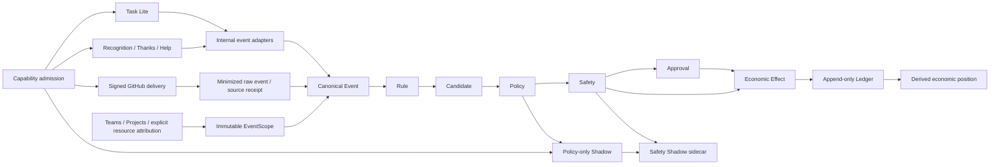

# System Integration / Maturity Gate: boundary review

Baseline inspected: `258339d3d2f223db1e7ef569dd3369155f4f1041`.
Graphify before test design: 3,147 nodes / 14,149 edges, current.
This is a source-grounded preflight, not an acceptance result.

## Dependency map

Connections are explicit services/API calls, not an automatic background event
pipeline. Persisting an event does not itself evaluate Rules, approve a Candidate,
or issue money. Task Lite retains its existing task economics; observing its
events does not authorize a second payout. Economic source-authority validation
remains mandatory. Recognition/Thanks/Help domain audit and notification writes
belong to their domain transaction. Generic economic provenance is its immutable
effect and ledger chain; a universal payout notification is not implied.

Provider parsing, HMAC verification and resource attribution reside in
`backend/app/github_connector/`; Core does not parse GitHub bodies. Organization
scope is captured at accepted event creation and subsequently read from history.
Unassigned resources are COMPANY-scoped. Rules and Policies independently apply
scope eligibility. Approval additionally checks current scoped authority.
Safety remains separate from Policy. Shadow and its Safety sidecar cannot write
economic effects. Ledger is append-only; Wallet is derived.

## Transaction and retry matrix

All service transactions below are caller-owned. HTTP command wrappers commit
success and roll back failure; headless callers must do the same. Separate HTTP
calls are separate transactions, even when adjacent in the logical pipeline.

| Transition | Atomic boundary / owner | Identity and immutable source | Retry / partial failure |
| --- | --- | --- | --- |
| Task mutation → internal Event | Domain command transaction | Task transition identity; CanonicalEvent | Adapter failure rolls back domain mutation; repeat obeys task lifecycle |
| Recognition/Thanks → Event/audit/notification | Collaboration command | Actor/submission identity; domain row and event | Same submission returns existing result; rollback leaves no partial credit |
| Help accept/finish/confirm → Event | Each lifecycle command separately | Help ID/state; completed event | Current membership gates new actions; committed completion remains historical |
| GitHub delivery → raw/receipt/Event/scope | Webhook transaction | Company/source/delivery and provider resource identity | Signature checked; duplicate accepted delivery returns existing event; failed transaction rolls back all writes |
| Resource attribution → future scope resolution | Admin organization-exclusive transaction | Tenant/resource interval and immutable change audit | No retroactive rewriting of completed EventScope |
| Event → Candidate | Explicit Rule evaluation transaction | Event plus immutable Rule version/evaluation | Committed Event survives failed evaluation; evaluation retry deduplicates Candidates |
| Candidate → PolicyDecision | Explicit Policy evaluation transaction | Candidate plus configuration/history identity | Candidate survives downstream rollback; retry returns correct decision identity |
| Policy → Safety | Explicit assessment or economic eligibility transaction | Candidate, frozen Safety evaluation/head/configuration | First assessment is frozen; explicit refresh has distinct auditable meaning |
| Safety → ApprovalRequest | Explicit approval command | PolicyDecision and, for Safety review, exact SafetyEvaluation | No implicit approval; unique request identity; rollback/retry safe |
| ApprovalRequest → decision | Approval command under request lock | One immutable final decision | Current role/scope and self-approval guard; conflicting repeat rejected |
| Approval/Safety → Effect → Ledger | Economic command; nested savepoint for effect/ledger | Tenant/Candidate/effect type; exact governance provenance | Candidate and wallet locks; savepoint prevents a caller catching an error and committing half an effect |
| Effect → response | Commit precedes successful HTTP response | Persisted economic identity | Lost response requires idempotent retry, not another payout |
| Effect → reversal → negative Ledger entry | Reversal command/savepoint | Original effect and unique full reversal | Same economic identity lock; repeated reversal returns prior result; debt may remain |
| Policy → Shadow | Explicit Shadow command | PolicyDecision and immutable projection | Independent identity, zero Ledger writes; capability gates new observation |
| Safety → Shadow sidecar | Explicit Safety Shadow command | PolicyDecision/SafetyEvaluation pair | Does not mutate policy-only projection; zero real economics |
| Capability change → subsequent admission | Exclusive capability lock versus shared admission lock | Capability change history | In-flight operation serializes; history survives disable; re-enable permits new operations |
| Membership/closure → scoped operations | Exclusive organization lock versus shared operations | Interval history, closure and OrganizationChange | Serialize admission; existing EventScope never re-derived from current membership |

Task and task-cycle mutations now acquire the existing organization lock
exclusively before other command locks. This prevents the verified M1 account
SHARE-to-NO-KEY-UPDATE upgrade deadlock. Admission checks remain intact. Task
writes serialize within a company against other organization-guarded operations;
different companies remain independent. Headless callers must enter commands
before taking conflicting account locks. See [defect evidence](DEFECTS.md).

## Boundaries requiring combined validation

The Safety Shadow entry point currently acquires capability/Safety/account locks
before calling an organization-guarded Shadow service. Approval creation acquires
organization before Safety. Organization writers acquire the exclusive
organization lock. A three-session queue cycle was tested with actual PostgreSQL waiters in
`backend/tests/test_system_integration_lock_order.py`: all three commands
completed successfully. No deadlock was reproduced and no production fix is
justified by this experiment. Retain the regression and track lock-order clarity
in the Cohesion backlog.

Source references: `backend/app/organization/service.py`,
`backend/app/github_connector/delivery.py`, `backend/app/github_connector/attribution.py`,
`backend/app/collaboration/help.py`, `backend/app/collaboration/common.py`,
`backend/app/rules/service.py`, `backend/app/policies/service.py`,
`backend/app/approvals/service.py`, `backend/app/incentive_safety/service.py`,
`backend/app/incentive_safety/shadow.py`, `backend/app/shadow/service.py`,
`backend/app/economic_effects/service.py`, `backend/app/economic_effects/eligibility.py`,
`backend/app/economic_effects/reversal.py`.

The subsequent workload and regression gate is [CLOSED / PASS](ACCEPTANCE.md);
see the [feature-island assessment](COHESION_BACKLOG.md).
